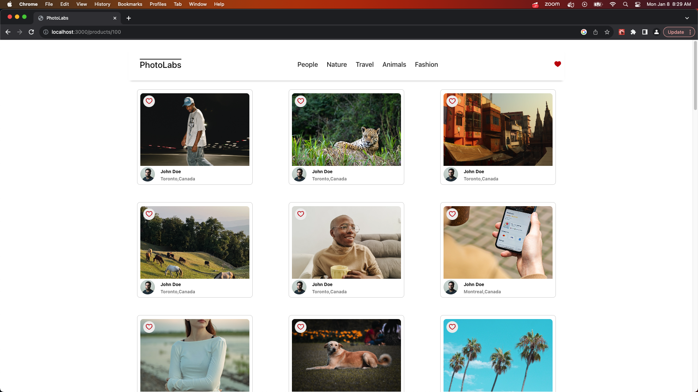
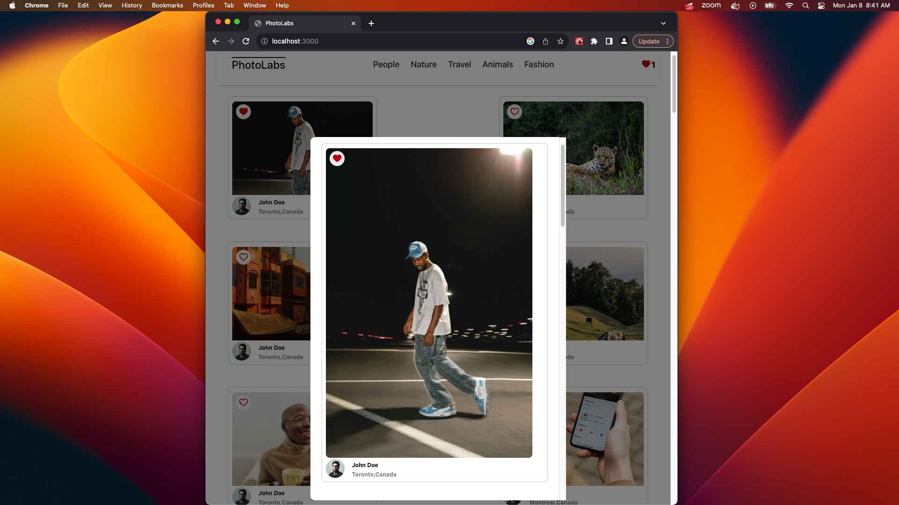
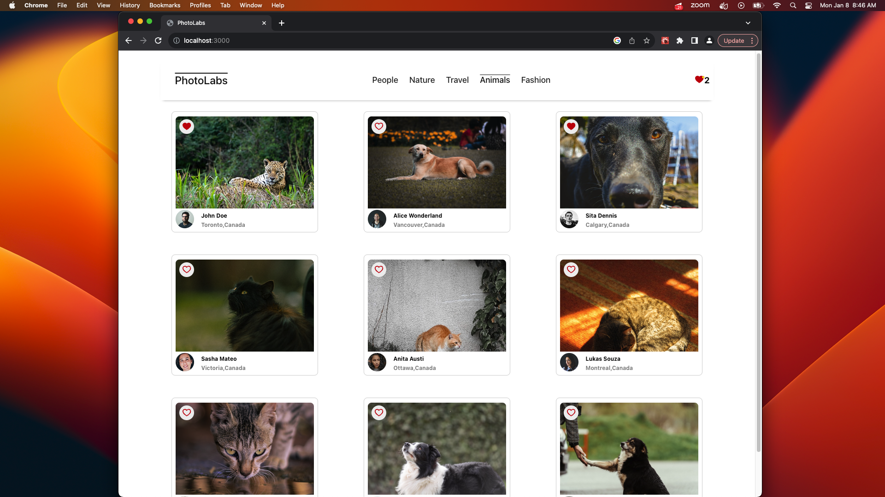
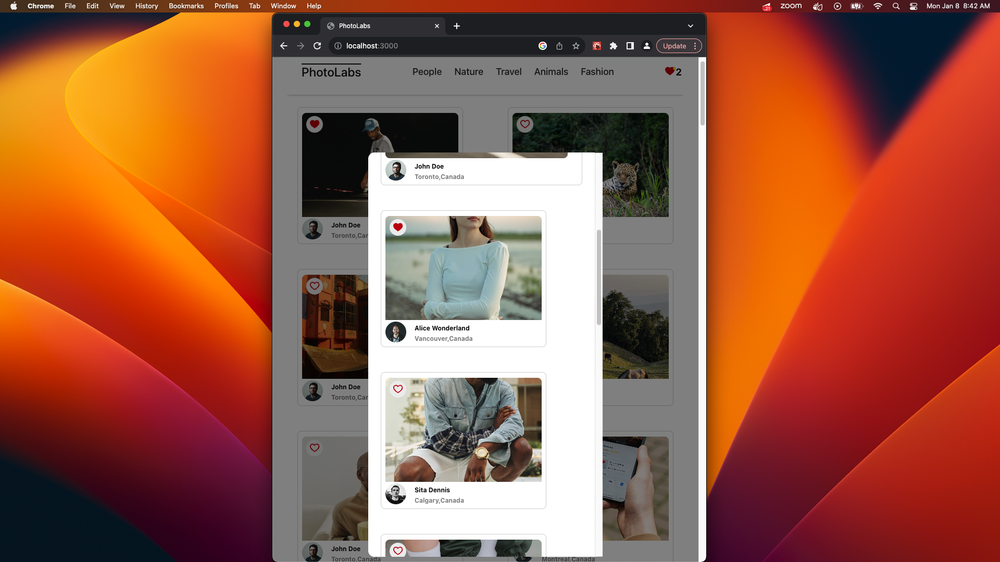

# react-photolabs
The PhotoLabs project for the Web Development React course programming.

# Photolabs

## Setup

Install dependencies with `npm install` in each respective `/frontend` and `/backend`.

## [Frontend] Running Webpack Development Server

```sh
cd frontend
npm start
```

## [Backend] Running Backend Servier

Read `backend/readme` for further setup details.

```sh
cd backend
npm start
```
## App Showcase


This is a demo app for viewing your photos like instagram!

The app is made for both desktop and devices with it's responsive design.


When selecting a photo, you can view it closely and favourite the photo.


You can also look at pics by your favourite topic!


The modal also has a scrollable and responsive design.

